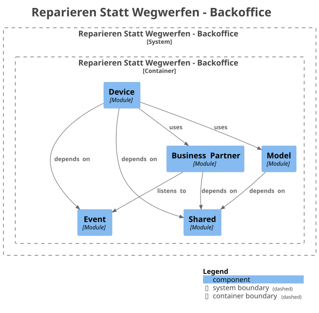

# Reparieren Statt Wegwerfen - Backoffice

This is the back-office application for my company,
[Reparieren Statt Wegwerfen](https://reparieren-statt-wegwerfen.at/), used to manage and track
my repair and refurbishment workflow. It replaces my legacy Apple Numbers-based solution,
which had reached the limits of its capabilities.

I decided to open-source this project to enforce better security practices, such as keeping
secrets out of the repository.

---

## Development Approach

Since I need this fast, I follow this approach: _Make it exist first, make it better later._

---

## 🏗️ Architecture & Design

The application is built adhering to modern architectural practices to ensure maintainability,
scalability, and clean boundaries:

- **Modular Monolith (Modulith):** Promotes a highly structured monolithic architecture with
  strictly enforced package boundaries, combining the simplicity of a single deployment with the
  decoupled nature of microservices.
- **Domain-Driven Design (DDD):** Core business logic is modeled after my real-world
  refurbishment and repair workflows.

The following domains have been identified:

| Domain               | Module Name       | Description                                                                                                                                                        |
|:---------------------|:------------------|:-------------------------------------------------------------------------------------------------------------------------------------------------------------------|
| **Model**            | `model`           | Manages the catalog of supported hardware definitions (specifically Apple Silicon M1 or newer devices) targeted for repair and refurbishment.                      |
| **Business Partner** | `businesspartner` | Handles data of both suppliers (sellers) and clients (buyers).                                                                                                     |
| **Device**           | `device`          | Tracks the entire lifecycle of a specific, physical asset—from initial acquisition through repair stages to a successful sale, or its disassembly for spare parts. |
| **Sale**             | `sale`            | Aggregates data from the Model, Business Partner, and Device domains to generate invoices.                                                                         |

---

## 🛠️ Tech Stack

- **Backend:** Java / Spring Boot
- **Frontend:** Angular + Clarity Design System
- **Database:** MySQL
- **Identity & Access Management:** Keycloak

---

## 📄 License

This project is licensed under the terms of the open-source license included in the repository.
See the `LICENSE` file for details.